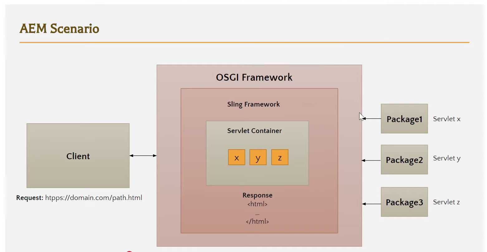

# AEM Servlet

 

1. What is an AEM Servlet?

    > An AEM Servlet is a Java class used in Adobe Experience Manager (AEM) to handle HTTP requests and generate responses.

2. Purpose: Used to process backend logic (e.g., reading/writing data in JCR) and return data (JSON, HTML, etc.) to the client.
3. Registration Types:

    - Path-based: Mapped using @SlingServletPath
    - Resource type-based: Mapped using @SlingServletResourceTypes

4. Common Use Case: Handling AJAX calls from the front end.
5.
