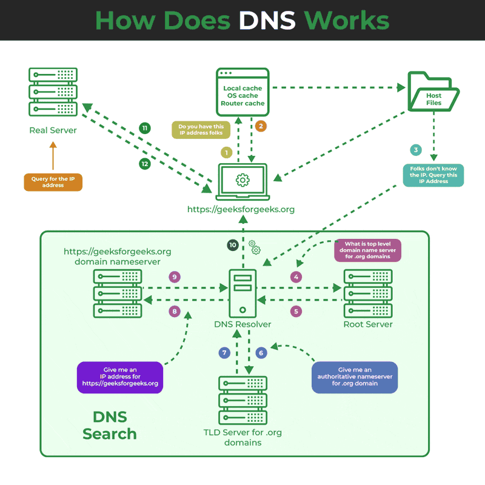
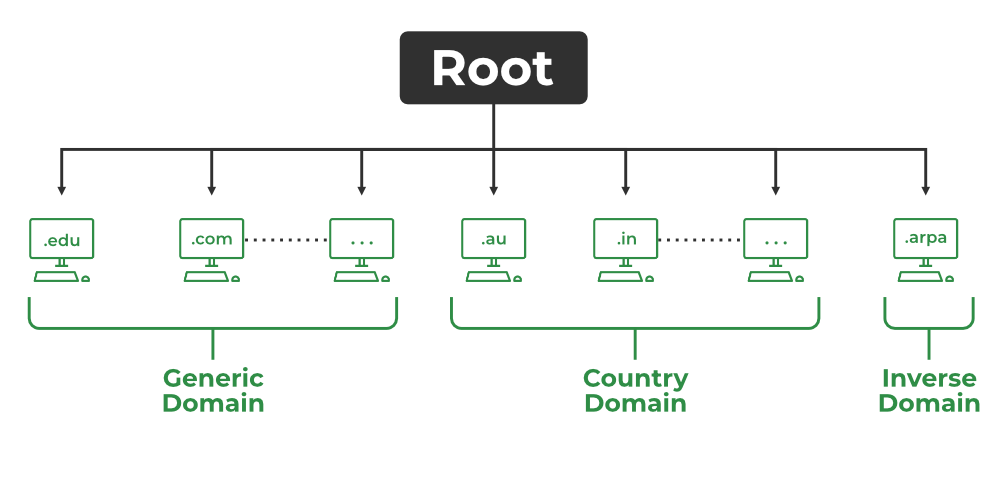
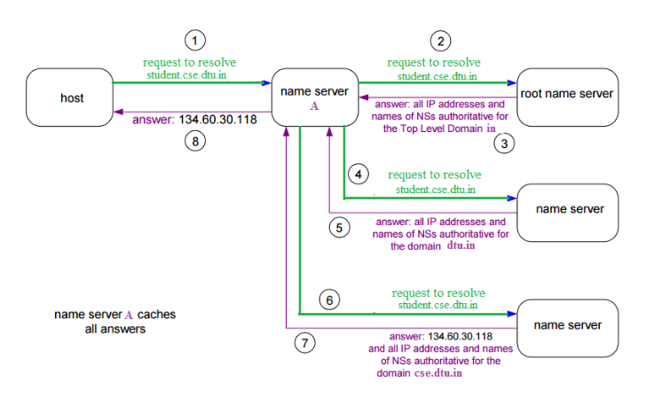

# Understanding DNS for a Public Website

DNS is a hierarchical and distributed naming system that translates domain names into IP addresses. When you type a domain name like www.geeksforgeeks.org into your browser, DNS ensures that the request reaches the correct server by resolving the domain to its corresponding IP address. Without DNS, we’d have to remember the numerical IP address of every website we want to visit, which is highly impractical.

  

1. User Input: You enter a website address (for example, www.geeksforgeeks.org) into your web browser.
2. Local Cache Check: Your browser first checks its local cache to see if it has recently looked up the domain. If it finds the corresponding IP address, it uses that directly without querying external servers.
3. DNS Resolver Query: If the IP address isn’t in the local cache, your computer sends a request to a DNS resolver. The resolver is typically provided by your Internet Service Provider (ISP) or your network settings.
4. Root DNS Server: The resolver sends the request to a root DNS server. The root server doesn’t know the exact IP address for www.geeksforgeeks.org but knows which Top-Level Domain (TLD) server to query based on the domain’s extension (e.g., .org).
5. TLD Server: The TLD server for .org directs the resolver to the authoritative DNS server for geeksforgeeks.org.
6. Authoritative DNS Server: This server holds the actual DNS records for geeksforgeeks.org, including the IP address of the website’s server. It sends this IP address back to the resolver.
7. Final Response: The DNS resolver sends the IP address to your computer, allowing it to connect to the website’s server and load the page.

Note: This entire process happens in milliseconds, enabling a fast and efficient browsing experience.

This hierarchical approach allows DNS to handle billions of queries every day, ensuring the stability and scalability of the internet.

---

### Types of Domains

 

1. Generic Domains: Top-level domains like .com, .org, .net and .edu. Widely used & recognized across world
2. Country Code Domains: Represent specific countries or regions, such as .in for India, .us for the United States etc
3. Inverse Domains: Inverse domains are used for reverse DNS lookups, which map IP addresses back to domain names. This helps in security, spam filtering, and network diagnostics. Example:
    - To find the IP of a domain: "nslookup www.geeksforgeeks.org:
    - To do a reverse lookup (IP → domain): "nslookup [IP address]"

---

### DNS : Domain Name Server

 

1. The client machine sends a request to the local name server to resolve a domain name.
2. If the local server doesn't have the record (in cache), it forwards the request to a root name server.
3. The root server either provides the IP address or directs the query to a TLD (Top-Level Domain) server.
4. The TLD server knows the authoritative name server and sends that information back.
5. The local name server then queries the authoritative name server.
6. The authoritative server responds with the correct IP address.
7. The local name server returns the IP address to the client.
8. The local server may also cache the response for future requests.

    **Example**:

    1. The host sends a request to the local name server to resolve student.cse.dtu.in.
    2. If not found in the cache, the local name server sends a query to the root name server.
    3. The root name server responds with the IP addresses of the TLD name servers for .in.
    4. The local name server then queries the .in TLD name server for dtu.in.
    5. The TLD name server replies with the IP addresses of the authoritative name servers for dtu.in.
    6. The local name server queries the authoritative name server for cse.dtu.in.
    7. The authoritative name server responds with the final IP address (134.60.30.118) and related info.
    8. The local name server returns the IP address to the host and caches the result for future use.

---

1. **DNS Lookup (or DNS Resolution)** : It is the process of translating a human-readable domain name (like www.example.com) into its corresponding IP address (like 192.0.2.1), which computers use to locate and communicate with each other on the internet

    - Think of it as: The entire journey to get the IP.

2. **DNS Resolver (or DNS Client)** : It's the component or tool (usually provided by your OS or ISP) that starts and manages the DNS Lookup process. It sends queries, waits for responses, and handles caching. The resolver is what does the work of performing the lookup on behalf of your browser or app.

    - Think of it as: The driver who takes you on that journey to find the IP.

3. Types of DNS Queries
    - Recursive Query: The DNS server must return the final answer (record or error), even if it has to query other servers.
    - Iterative Query: The DNS server returns the best answer it can, usually a referral to another server closer to the answer.
    - Non-Recursive Query: The DNS server answers directly from its cache, without querying other servers.
