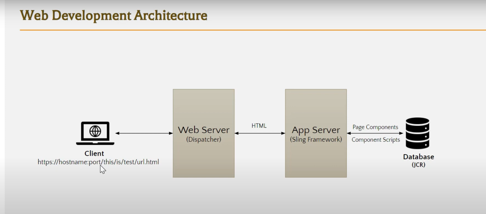
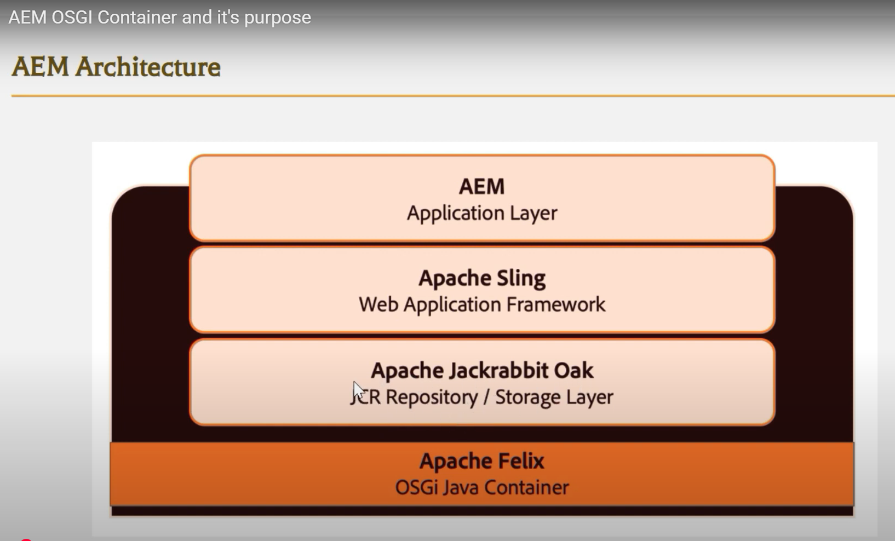

# Architecure

**1. Genreal Web Development Architecture:**
Client (user browser) > Web server > App server > Database

    a) If it's a static page (url.html), request gets served from Webserver.
    b) If dynamic content is needed, then App server is also needed.
    c) Java framewrok : Looks the URL came from client. Java, it's class etc are all stored in App server

**2. AEM Web Development Architecture:**
Client (user browser) > Web server (Dispatcher) > App server (Sling Framework) > Database (JCR)

    a) App Server : Apache Sling Framework is used. It's work is to check which JAVA class/Code to use, when this URL is called.
    b) JCR : No-SQL Database

 

