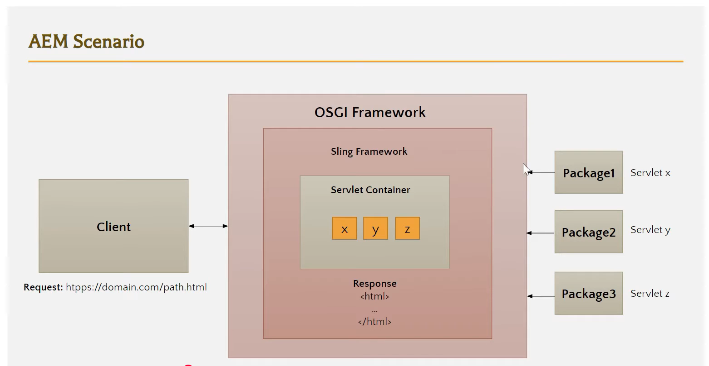

# AEM Servlet

 

1. AEM Servlet :

    > An AEM Servlet is a Java class used in AEM to handle HTTP requests & generate responses.

2. Purpose: Used to process backend logic (e.g., reading/writing data in JCR) and return data (JSON, HTML, etc.) to the client.
3. Registration Types:

    - Path-based: Mapped using @SlingServletPath
    - Resource type-based: Mapped using @SlingServletResourceTypes

4. Common Use Case: Handling AJAX calls from the front end.

    > AJAX stands for Asynchronous JavaScript and XML — it's a technique used in web development to send & receive data from a server without refreshing the web page.

    > Simply, AJAX lets you update part of a web page without reloading the whole page.

    - AJAX is not a programming language — it's a technique using:
        - JavaScript – to make requests
        - XMLHttpRequest or fetch() API – to talk to the server
        - JSON (instead of XML in modern apps) – to send/receive data
        - HTML/CSS – to update the UI dynamically

    Why Use AJAX?
    | Without AJAX | With AJAX |
    | ----------------------------------- | ----------------------------- |
    | Whole page reloads on every request | Only parts of the page update |
    | Slower, more load on server | Faster and smoother UX |
    | Breaks user flow | Keeps user in context |

5.
